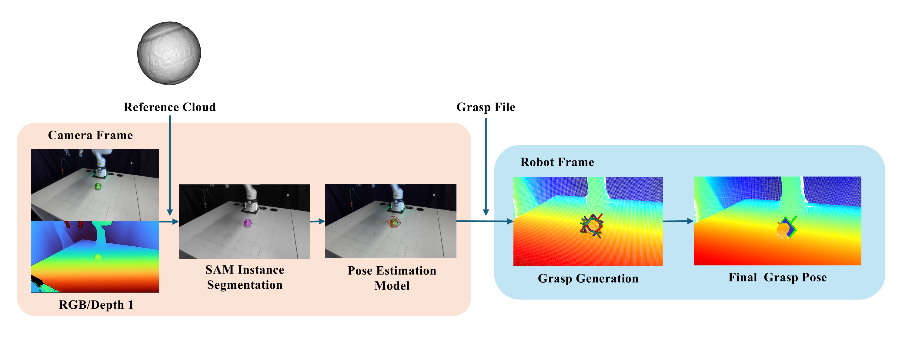

# grasp_sam6d ROS2 Wrapper (with ZED Camera and Grasp Synthesis)

A ROS 2 Python node that leverages the work of [SAM-6D](https://github.com/JiehongLin/SAM-6D),
integrated with a ZED camera for grasp synthesis tasks.

The original SAM-6D uses a Conda-based environment. However, since ROS 2 generally works best without multiple environments, it’s recommended to use this [modified SAM-6D](https://github.com/MrGerencser/SAM-6D) version to install the necessary Python packages globally rather than inside Conda. This ensures smoother integration with ROS 2 and avoids environment conflicts.



💡 See also: For an alternative approach to 6D pose and grasp estimation, check out [superquadric_grasp_system](https://github.com/MrGerencser/superquadric_grasp_system)

---

## Table of Contents

- [Prerequisites](#prerequisites)
- [Installation](#installation)
- [Quick Start](#quick-start)
- [Controlling the Robot](#controlling-the-robot)
- [Troubleshooting](#troubleshooting)
- [License & Contact](#license--contact)


## Prerequisites

- ROS 2 Humble (Ubuntu 22.04)  
- [ZED SDK](https://www.stereolabs.com/en-ch/developers/release) - (tested with version 5.0.5)
- [Franka ROS 2 packages](https://github.com/frankarobotics/franka_ros2) (tested with v0.1.15)
- [modified SAM-6D](https://github.com/MrGerencser/SAM-6D)


## Installation

1. **Clone the package into your ROS 2 workspace**
   ```bash
   cd ~/franka_ros2_ws/src
   git clone https://github.com/MrGerencser/grasp_sam6d
   ```

2. **Install dependencies**
   ```bash
   cd ~/franka_ros2_ws
   rosdep install --from-paths src --ignore-src -r -y
   ```
3. **Install Hugging Face Hub** (required for downloading object models)
   ```bash
   pip install --upgrade huggingface_hub
   ```

4. **Download object models**
   ```bash
   cd src/grasp_sam6d
   python scripts/download_object_models.py   # or provide your own CAD files
   ```

5. **Build**
   ```bash
   cd ~/franka_ros2_ws
   colcon build --cmake-args -DCMAKE_BUILD_TYPE=Release
   source install/setup.bash
   ```


## Quick Start

1. **Set camera transforms**  
   Edit `config/transformations.yaml` (use the [camera calibration tool](https://github.com/MrGerencser/camera_calibration) to obtain transforms).

1. **Set file paths in launch file**  
   Edit `launch/grasp_sam6d.launch.py` (CAD file path of object & path to SAM-6D installation).

3. **Rebuild after config/model changes**
   ```bash
   cd ~/franka_ros2_ws
   colcon build --cmake-args -DCMAKE_BUILD_TYPE=Release
   source install/setup.bash
   ```

4. **Launch Node**
   ```bash
   ros2 launch grasp_sam6d grasp_sam6d.launch.py 
   ```

## Controlling the Robot

This repo includes a [grasp_executor.py](grasp_sam6d/grasp_executor.py) demo script for grasp execution with this [Cartesian Impedance Controller](https://github.com/MrGerencser/cartesian_impedance_control).       
[grasp_executor.py](grasp_sam6d/grasp_executor.py) doesn't include object avoidance or other safety filters.

**Example workflow:**
```bash
# Terminal 1: Launch perception
ros2 launch grasp_sam6d grasp_sam6d.launch.py 

# Terminal 2: Launch Cartesian impedance control
ros2 launch cartesian_impedance_control cartesian_impedance_controller.launch.py

# Terminal 3: Run grasp executor
ros2 run grasp_sam6d grasp_executor
```

Set drop location inside `grasp_executor.py`:
```python
'drop_box': {'x': 0.2, 'y': 0.6, 'z': 0.18}
```

   ---

## Troubleshooting

[Open-GL](https://support.stereolabs.com/hc/en-us/articles/8422008229143-How-can-I-solve-ZED-SDK-OpenGL-issues-under-Ubuntu) Issue with ZED camera

---

## License & Contact

Licensed under the MIT License.  
For questions and support, open an issue.
